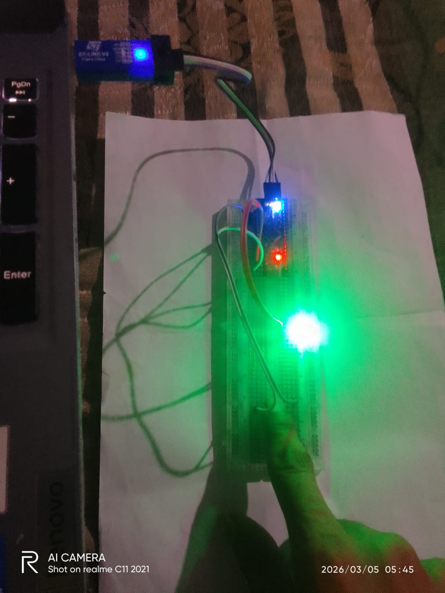

# 🔬 STM32F103 Bare Metal — GPIO Digital Sensor Interface
### STM32F103C6/C8 | Keil MDK | Bare Metal C | No HAL | No Library

<div align="center">


</div>

---

## 📌 Project Overview

This project demonstrates **Bare Metal GPIO programming** on STM32F103 without using HAL or any library. Direct register manipulation is used to interface various **digital sensors and input devices**.

### ✅ Key Features:
- Pure Bare Metal C — No HAL, No Library
- Direct Register Access
- Works with ANY digital sensor (Active HIGH or LOW)
- Button Debounce implemented
- LED Toggle logic included
- Compatible with STM32F103C6 and C8 (Blue Pill)

---

## 🛠️ Hardware Used

| Component | Specification |
|-----------|-------------|
| MCU | STM32F103C6/C8T6 (Blue Pill) |
| IDE | Keil MDK uVision |
| Programmer | STM32CubeProgrammer (via ST-Link V2) |
| Input | Push Button / Digital Sensor |
| Output | Built-in LED (PC13) |
| Power | 5V USB / 3.3V onboard |

---

## 📁 Project Structure

```
STM32_GPIO_Bare_Metal/
├── 📄 blink_led.c          ← LED Blink (Basic)
├── 📄 button_led.c         ← Button → LED ON/OFF
├── 📄 button_toggle.c      ← Button → LED Toggle
├── 📄 button_count.c       ← Button Count → Blink
└── 📄 README.md
```

---

## 🔌 Pin Configuration

```
STM32F103 Blue Pill
───────────────────────────────
PC13  → Built-in LED (Active LOW)
PA0   → Digital Input (Sensor/Button)
PA1   → External LED Output (Optional)
5V    → Sensor VCC
GND   → Common Ground
```

---

## 💻 Base Code — GPIO Register Setup

```c
int main(void)
{
    /* ── RCC Clock Enable ─────────────────────── */
    unsigned int *RCC_APB2ENR = (unsigned int *)(0x40021000 + 0x18);
    *RCC_APB2ENR |= (1 << 2); /* GPIOA Clock ON */
    *RCC_APB2ENR |= (1 << 4); /* GPIOC Clock ON */

    /* ── PC13 → Output Push-Pull (LED) ────────── */
    unsigned int *GPIOC_CRH = (unsigned int *)(0x40011000 + 0x04);
    *GPIOC_CRH &= ~(0xF << 20); /* Clear bits */
    *GPIOC_CRH |=  (0x2 << 20); /* Output 2MHz Push-Pull */

    /* ── PA0 → Input Pull-up (Sensor/Button) ──── */
    unsigned int *GPIOA_CRL = (unsigned int *)(0x40010800 + 0x00);
    unsigned int *GPIOA_ODR = (unsigned int *)(0x40010800 + 0x0C);
    unsigned int *GPIOA_IDR = (unsigned int *)(0x40010800 + 0x08);
    unsigned int *GPIOC_ODR = (unsigned int *)(0x40011000 + 0x0C);

    *GPIOA_CRL &= ~(0xF << 0);
    *GPIOA_CRL |=  (0x8 << 0); /* Input Pull-up/Pull-down */
    *GPIOA_ODR |=  (1 << 0);   /* Pull-up Enable */

    /* ── LED OFF Initially ─────────────────────── */
    *GPIOC_ODR |= (1 << 13);

    while(1)
    {
        if(!(*GPIOA_IDR & (1 << 0))) /* Sensor Active LOW */
        {
            *GPIOC_ODR &= ~(1 << 13); /* LED ON */
        }
        else
        {
            *GPIOC_ODR |=  (1 << 13); /* LED OFF */
        }
    }
}
```

---

## 📡 Compatible Digital Sensors

> ⚡ **All sensors below work with the SAME base code — just change the connection!**

---

### 1. 🔘 Push Button
```
Connection:
PA0 → Button → GND
(Internal Pull-up — No resistor needed!)

Behavior:
Button NOT pressed → PA0 HIGH → LED OFF
Button Pressed     → PA0 LOW  → LED ON ✅

Use Cases:
→ Manual control systems
→ Emergency stop button
→ Machine start/stop
→ User input interface
```

---

### 2. 🔥 Flame Sensor (HW-484 / KY-026)
```
Connection:
VCC → 5V
GND → GND
DO  → PA0

Behavior:
No Flame → DO HIGH → LED OFF
Flame    → DO LOW  → LED ON ✅

Use Cases:
→ Fire alarm system
→ Gas stove safety monitor
→ Industrial fire detection
→ Forest fire alert
→ Boiler flame monitor

Sensitivity:
→ Blue trimpot se adjust karo
→ Range: 20cm to 100cm
```

---

### 3. 📳 Vibration Sensor (SW-420 / KY-002)
```
Connection:
VCC → 3.3V or 5V
GND → GND
DO  → PA0

Behavior:
No Vibration → DO HIGH → LED OFF
Vibration    → DO LOW  → LED ON ✅

Use Cases:
→ Earthquake detection
→ Theft/tamper alarm
→ Machine vibration monitor
→ Vehicle movement detect
→ Fall detection (basic)
```

---

### 4. 🚗 IR Obstacle Sensor (FC-51 / HW-201)
```
Connection:
VCC → 5V
GND → GND
OUT → PA0

Behavior:
No Obstacle → OUT HIGH → LED OFF
Obstacle    → OUT LOW  → LED ON ✅

Use Cases:
→ Robot obstacle avoidance
→ Object counting system
→ Automatic door opener
→ Line following robot
→ Parking sensor

Sensitivity:
→ Trimpot se adjust karo
→ Range: 2cm to 30cm
```

---

### 5. 🔊 Sound/Clap Sensor (KY-037 / HW-484)
```
Connection:
VCC → 5V
GND → GND
DO  → PA0

Behavior:
No Sound → DO HIGH → LED OFF
Sound    → DO LOW  → LED ON ✅

Use Cases:
→ Clap switch (light control)
→ Sound activated alarm
→ Baby cry monitor
→ Glass break detector
→ Noise level alert

Note:
→ Sensitivity trimpot se adjust karo
→ Loud sound pe trigger hoga
```

---

### 6. 💧 Rain/Water Sensor
```
Connection:
VCC → 5V
GND → GND
DO  → PA0

Behavior:
No Water → DO HIGH → LED OFF
Water    → DO LOW  → LED ON ✅

Use Cases:
→ Rain alert system
→ Automatic wiper control
→ Flood detection
→ Plant watering reminder
→ Roof leak detection
```

---

### 7. 🌡️ Temperature Sensor Digital (KY-028 / LM35 with comparator)
```
Connection:
VCC → 5V
GND → GND
DO  → PA0

Behavior:
Normal Temp → DO HIGH → LED OFF
High Temp   → DO LOW  → LED ON ✅

Use Cases:
→ Overheat protection
→ Fire/Heat detection
→ Incubator temperature alert
→ Server room monitoring
→ Battery temperature guard

Sensitivity:
→ Trimpot se threshold set karo
```

---

### 8. ☀️ LDR Light Sensor (KY-018 with comparator)
```
Connection:
VCC → 5V
GND → GND
DO  → PA0

Behavior:
Light  → DO HIGH → LED OFF
Dark   → DO LOW  → LED ON ✅

Use Cases:
→ Automatic street light
→ Day/Night switch
→ Solar tracker
→ Screen brightness control
→ Burglar alarm (laser trip)
```

---

### 9. 🧲 Reed Switch / Hall Effect Sensor (KY-021 / KY-003)
```
Connection:
One leg → PA0
Other   → GND
(Or VCC/GND/DO for module)

Behavior:
No Magnet → HIGH → LED OFF
Magnet    → LOW  → LED ON ✅

Use Cases:
→ Door/Window security sensor
→ RPM counter (motor speed)
→ Bicycle speedometer
→ Proximity switch
→ Position detection
```

---

### 10. 🏃 PIR Motion Sensor (HC-SR501)
```
Connection:
VCC → 5V
GND → GND
OUT → PA0

Behavior: ⚠️ Active HIGH!
No Motion → OUT LOW  → Change code!
Motion    → OUT HIGH → Change code!

/* Code change for Active HIGH sensor */
if(*GPIOA_IDR & (1 << 0)) /* Active HIGH */
{
    *GPIOC_ODR &= ~(1 << 13); /* LED ON */
}

Use Cases:
→ Security alarm
→ Automatic light
→ Intruder detection
→ Smart home automation
→ Energy saving systems

Warm-up time: 30-60 seconds!
```

---

### 11. ⛽ Gas Sensor (MQ-2 / MQ-135 Digital)
```
Connection:
VCC → 5V
GND → GND
DO  → PA0

Behavior:
No Gas  → DO HIGH → LED OFF
Gas     → DO LOW  → LED ON ✅

Use Cases:
→ LPG gas leak detection
→ Smoke alarm
→ Air quality monitor
→ Kitchen safety system
→ Industrial gas monitor

Preheat time: 20 seconds!
```

---

### 12. 🔵 Touch Sensor (KY-036 / TTP223)
```
Connection:
VCC → 3.3V or 5V
GND → GND
SIG → PA0

Behavior:
No Touch → SIG LOW  → LED OFF
Touch    → SIG HIGH → Change code!

/* Code for Active HIGH */
if(*GPIOA_IDR & (1 << 0))
{
    *GPIOC_ODR &= ~(1 << 13); /* LED ON */
}

Use Cases:
→ Capacitive touch button
→ Smart switch
→ Touch lamp
→ Keypad replacement
→ Proximity sensing
```

---

## 📊 Sensor Comparison Table

| Sensor | VCC | Active | Pull-up | Code Change |
|--------|-----|--------|---------|-------------|
| Push Button | — | LOW | Internal ✅ | No |
| Flame Sensor | 5V | LOW | Internal ✅ | No |
| Vibration SW-420 | 5V | LOW | Internal ✅ | No |
| IR Obstacle FC-51 | 5V | LOW | Internal ✅ | No |
| Sound KY-037 | 5V | LOW | Internal ✅ | No |
| Rain Sensor | 5V | LOW | Internal ✅ | No |
| Temperature KY-028 | 5V | LOW | Internal ✅ | No |
| LDR KY-018 | 5V | LOW | Internal ✅ | No |
| Reed Switch | — | LOW | Internal ✅ | No |
| PIR HC-SR501 | 5V | **HIGH** | Floating | **Yes** ⚠️ |
| Gas MQ-2 | 5V | LOW | Internal ✅ | No |
| Touch TTP223 | 3.3V | **HIGH** | Floating | **Yes** ⚠️ |

---

## ⚠️ Active HIGH Sensor — Code Change:

```c
/* Active LOW sensors (most sensors) */
if(!(*GPIOA_IDR & (1 << 0))) /* NOT operator! */
{
    *GPIOC_ODR &= ~(1 << 13); /* LED ON */
}

/* Active HIGH sensors (PIR, Touch) */
if(*GPIOA_IDR & (1 << 0)) /* No NOT operator! */
{
    *GPIOC_ODR &= ~(1 << 13); /* LED ON */
}
```

---

## 📋 Register Reference

| Register | Address | Purpose |
|----------|---------|---------|
| RCC_APB2ENR | 0x40021018 | GPIO Clock Enable |
| GPIOA_CRL | 0x40010800 | PA0-PA7 Config |
| GPIOA_CRH | 0x40010804 | PA8-PA15 Config |
| GPIOA_IDR | 0x40010808 | PA Input Read |
| GPIOA_ODR | 0x4001080C | PA Output Write |
| GPIOC_CRH | 0x40011004 | PC8-PC15 Config |
| GPIOC_ODR | 0x4001100C | PC Output Write |

---

## 🔧 GPIO Mode Configuration

```
CNF[1:0] MODE[1:0] = Description
─────────────────────────────────
00        00        = Input Analog
01        00        = Input Floating
10        00        = Input Pull-up/Pull-down
00        01        = Output Push-Pull 10MHz
00        10        = Output Push-Pull 2MHz  ← We use this
00        11        = Output Push-Pull 50MHz
```

---

## 💡 Important Notes

```
1. PC13 = Active LOW LED
   → LOW  = LED ON
   → HIGH = LED OFF

2. Internal Pull-up = 40KΩ
   → Good for prototype
   → External 10KΩ for PCB

3. Clone Blue Pill boards:
   → Use STM32CubeProgrammer
   → Keil direct flash fails
   → "Not genuine ST device" error

4. 5V sensors → DO pin = 3.3V compatible
   → Safe to connect directly to PA0

5. Always add decoupling capacitor
   → 100nF near sensor VCC pin
```

---

## 🚀 How to Flash

```
1. Keil MDK mein code likho
2. Build karo (F7)
3. Hex file generate hoga:
   Objects/project.hex
4. STM32CubeProgrammer kholo
5. ST-Link connect karo
6. Hex file select karo
7. Download click karo ✅
8. Test karo! 🔥
```

---

## 👨‍💻 Developer

**Ramsudarshan Maurya**
🎓 B.Tech ECE — AKTU Lucknow (2025)
🏢 Embedded Systems Intern — UniConverge Technologies, Noida
📚 IoT Trainee — IoT Academy, Noida
🏆 RoboRace 1st Prize | Published Researcher IJRPR

[](https://linkedin.com/in/ramsudarshanmaurya)
[](https://github.com/Ramsudarshanmaurya)

---

## 📄 License

MIT License — Free to use, modify and distribute with attribution.

---

<div align="center">

**⭐ Agar helpful laga toh Star zaroor do! ⭐**

*"Bare Metal = Direct Hardware Control — Real Embedded Engineering!"* 🔧

</div>

## 📸 Hardware Demo


## 🎥 Video Demo
> ▶️ **[Click here to watch Button LED working video](media/button_led.mp4)**
