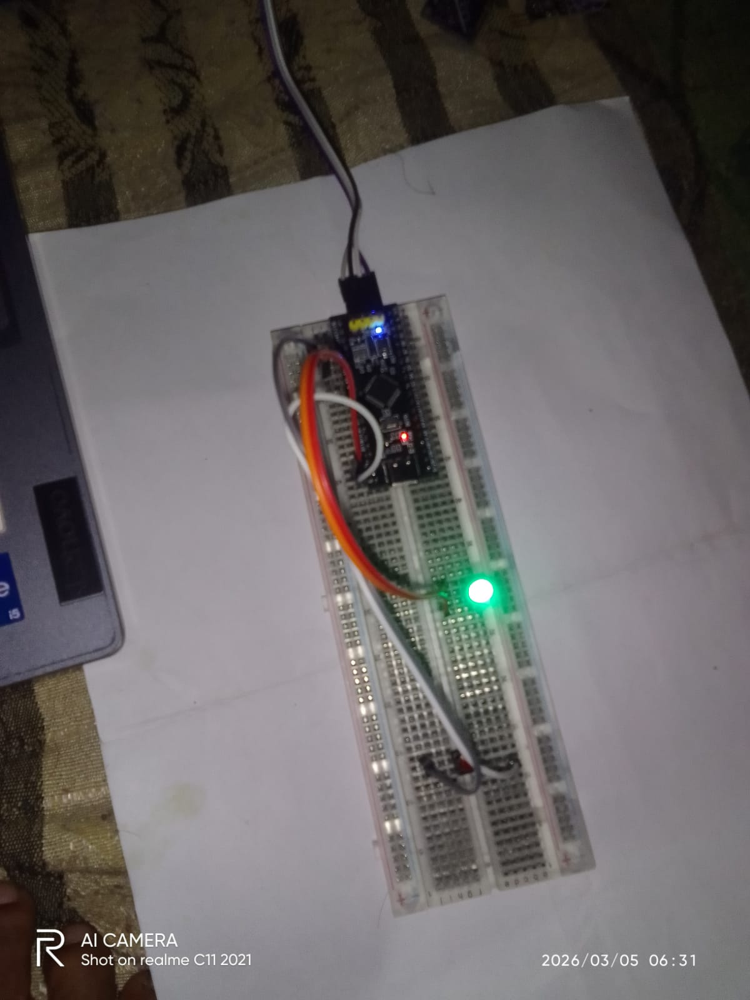

# 🔘 STM32F103 Bare Metal — Button Toggle LED
### GPIO Input + Output | Debounce | Toggle Logic | Real World Applications

<div align="center">


</div>

---

## 📌 Project Overview

This project demonstrates **Button Toggle LED** using **Bare Metal C** on STM32F103.
A single button press toggles both the built-in LED (PC13) and an external LED (PA1).
Debounce logic is implemented to prevent false triggering.

### ✅ Key Features:
- Pure Bare Metal C — No HAL, No Library
- Direct Register Manipulation
- Software Debounce implemented
- LED Toggle using XOR logic
- Built-in + External LED control
- Internal Pull-up — No external resistor needed
- Compatible with STM32F103C6 and C8 (Blue Pill)

---

## 🛠️ Hardware Used

| Component | Specification |
|-----------|-------------|
| MCU | STM32F103C6/C8T6 (Blue Pill) |
| IDE | Keil MDK uVision |
| Programmer | STM32CubeProgrammer (ST-Link V2) |
| Button | Tactile Push Button |
| LED 1 | Built-in LED (PC13) |
| LED 2 | External LED (PA1) |
| Power | 3.3V / 5V USB |

---

## 🔌 Hardware Connection

```
STM32 Blue Pill      Component
──────────────────────────────────
PA0          →       Button → GND
PA1          →       External LED → GND
PC13         →       Built-in LED (onboard)
3.3V/5V      →       VCC
GND          →       Common GND
```

### Circuit Diagram:
```
3.3V
 │
40KΩ (Internal Pull-up)
 │
PA0 ──────────── [Button] ──── GND

PA1 ──────────── [LED] ──── GND
                  (Active HIGH)

PC13 ─────────── [LED] ──── 3.3V
                  (Active LOW — Built-in)
```

---

## 💻 Full Code

```c
int main(void)
{
    /* ── RCC Clock Enable ─────────────────────── */
    unsigned int *RCC_APB2ENR = (unsigned int *)(0x40021000 + 0x18);
    *RCC_APB2ENR |= (1 << 2); /* GPIOA Clock ON */
    *RCC_APB2ENR |= (1 << 4); /* GPIOC Clock ON */

    /* ── PC13 → Output Push-Pull (Built-in LED) ─ */
    unsigned int *GPIOC_CRH = (unsigned int *)(0x40011000 + 0x04);
    *GPIOC_CRH &= ~(0xF << 20);
    *GPIOC_CRH |=  (0x2 << 20);

    /* ── PA0 → Input Pull-up (Button) ───────────  */
    /* ── PA1 → Output Push-Pull (External LED) ──  */
    unsigned int *GPIOA_CRL = (unsigned int *)(0x40010800 + 0x00);
    unsigned int *GPIOA_ODR = (unsigned int *)(0x40010800 + 0x0C);
    unsigned int *GPIOA_IDR = (unsigned int *)(0x40010800 + 0x08);
    unsigned int *GPIOC_ODR = (unsigned int *)(0x40011000 + 0x0C);

    /* PA0 → Input Pull-up */
    *GPIOA_CRL &= ~(0xF << 0);
    *GPIOA_CRL |=  (0x8 << 0);
    *GPIOA_ODR |=  (1 << 0);

    /* PA1 → Output 2MHz Push-Pull */
    *GPIOA_CRL &= ~(0xF << 4);
    *GPIOA_CRL |=  (0x2 << 4);

    /* Both LEDs OFF initially */
    *GPIOC_ODR |=  (1 << 13);
    *GPIOA_ODR &= ~(1 << 1);

    unsigned int led_state = 0;

    while(1)
    {
        if(!(*GPIOA_IDR & (1 << 0)))       /* Button pressed */
        {
            for(volatile int i = 0; i < 50000; i++); /* Debounce */

            if(!(*GPIOA_IDR & (1 << 0)))   /* Confirm press */
            {
                led_state ^= 1;             /* XOR Toggle */

                if(led_state)
                {
                    *GPIOC_ODR &= ~(1 << 13); /* Built-in ON  */
                    *GPIOA_ODR |=  (1 << 1);  /* External ON  */
                }
                else
                {
                    *GPIOC_ODR |=  (1 << 13); /* Built-in OFF */
                    *GPIOA_ODR &= ~(1 << 1);  /* External OFF */
                }

                while(!(*GPIOA_IDR & (1 << 0))); /* Wait release */
            }
        }
    }
}
```

---

## 🧠 Logic Explanation

### XOR Toggle:
```
led_state ^= 1

Press 1: 0 ^ 1 = 1 → LED ON  ✅
Press 2: 1 ^ 1 = 0 → LED OFF ✅
Press 3: 0 ^ 1 = 1 → LED ON  ✅
Press 4: 1 ^ 1 = 0 → LED OFF ✅
```

### Debounce Logic:
```
Button mechanical bounce:
1 press = 10-20 fake signals ❌

Solution:
1. Button press detect karo
2. 50ms wait karo
3. Dobara check karo
4. Confirm ho tab action lo ✅
```

### Pull-up Logic:
```
Internal 40KΩ Pull-up:

Button NOT pressed:
PA0 = 3.3V (HIGH) → No action

Button Pressed:
PA0 = GND (LOW) → Toggle! ✅

No external resistor needed! 😊
```

---

## 🌍 Real World Applications

---

### 🏭 1. Industrial Automation
```
Button Replace Karo:          LED Replace Karo:
─────────────────────────────────────────────
Start Button    →  PA0        Relay  → PA1
Emergency Stop  →  PA0        Motor  → PA1 (via L298N)
Reset Button    →  PA0        Alarm  → PA1 (Buzzer)
Mode Switch     →  PA0        Valve  → PA1 (Solenoid)

Real Example:
→ Machine START/STOP toggle switch
→ Conveyor belt ON/OFF control
→ Industrial fan toggle
→ Pump ON/OFF system
→ Emergency stop with indicator
```

---

### 🏠 2. Smart Home Automation
```
Button:                        Output:
──────────────────────────────────────
Wall switch     → PA0         Relay     → PA1 → AC Bulb
Touch sensor    → PA0         LED strip → PA1
Door bell btn   → PA0         Buzzer    → PA1
Remote button   → PA0         Fan       → PA1

Real Example:
→ Single button light switch
→ Fan ON/OFF toggle
→ Smart doorbell
→ Night lamp toggle
→ Bathroom exhaust fan
```

---

### 🚗 3. Automotive Systems
```
Button:                        Output:
──────────────────────────────────────
Steering button → PA0         Horn relay    → PA1
Door switch     → PA0         Interior LED  → PA1
Trunk button    → PA0         Trunk motor   → PA1
Seat button     → PA0         Seat motor    → PA1

Real Example:
→ Interior light toggle
→ Central lock toggle
→ Window up/down
→ Hazard light toggle
→ Parking sensor toggle
```

---

### 🏥 4. Medical Devices
```
Button:                        Output:
──────────────────────────────────────
Nurse call btn  → PA0         Alert LED   → PA1
Patient button  → PA0         Buzzer      → PA1
Power button    → PA0         Display     → PA1

Real Example:
→ Nurse call system
→ Medicine dispenser toggle
→ Patient alert toggle
→ Medical equipment ON/OFF
→ IV pump control
```

---

### 🤖 5. Robotics
```
Button:                        Output:
──────────────────────────────────────
Start button    → PA0         Motor relay → PA1
Mode button     → PA0         Status LED  → PA1
Speed button    → PA0         Buzzer      → PA1

Real Example:
→ Robot START/STOP toggle
→ Operating mode change
→ Arm gripper open/close
→ LED headlight toggle
→ Speed mode toggle
```

---

### 🔒 6. Security Systems
```
Button:                        Output:
──────────────────────────────────────
Arm/Disarm btn  → PA0         Siren     → PA1
Panic button    → PA0         LED alert → PA1
Reset button    → PA0         Relay     → PA1

Real Example:
→ Alarm arm/disarm toggle
→ Panic button alert
→ Door lock toggle
→ CCTV recording toggle
→ Gate open/close
```

---

### ⚡ 7. Power Systems
```
Button:                        Output:
──────────────────────────────────────
Power button    → PA0         Relay      → PA1
Reset button    → PA0         Load LED   → PA1
Mode button     → PA0         Inverter   → PA1

Real Example:
→ UPS bypass toggle
→ Solar/Grid switch toggle
→ Load bank ON/OFF
→ Generator start/stop
→ Battery charging toggle
```

---

### 🌾 8. Agriculture / IoT
```
Button:                        Output:
──────────────────────────────────────
Manual button   → PA0         Water pump → PA1
Mode button     → PA0         Valve      → PA1
Reset button    → PA0         Motor      → PA1

Real Example:
→ Irrigation pump toggle
→ Greenhouse fan toggle
→ Sprinkler ON/OFF
→ Poultry light toggle
→ Fish tank pump toggle
```

---

## 📊 What Can Replace Button (PA0):

```
Any Digital Sensor works on PA0!

Sensor              Signal    Use Case
────────────────────────────────────────────
PIR Motion Sensor → HIGH  →  Auto light toggle
IR Obstacle       → LOW   →  Object counter
Reed Switch       → LOW   →  Door security
Vibration SW-420  → LOW   →  Anti-theft toggle
Sound KY-037      → LOW   →  Clap switch
Touch TTP223      → HIGH  →  Touch lamp
Tilt Sensor       → LOW   →  Tilt alarm
Float Switch      → LOW   →  Water pump auto
Limit Switch      → LOW   →  Motor stop
Foot Switch       → LOW   →  Hands-free toggle
```

---

## 📊 What Can Replace LED (PA1):

```
Any Load works on PA1!
(Use driver circuit for high power)

Load              Driver        Current
────────────────────────────────────────
LED               Direct        10-20mA ✅
Buzzer            Direct        20mA ✅
Small Motor       L298N         2A ⚠️
Relay 5V          Transistor    50mA ⚠️
AC Bulb           Relay         10A ⚠️
Solenoid Valve    MOSFET        1A ⚠️
DC Motor          L298N         2A ⚠️
Servo Motor       Direct PWM    500mA ⚠️
LED Strip         MOSFET        3A ⚠️
Heating Element   MOSFET        5A ⚠️
```

---

## ⚠️ GPIO Current Limit:

```
STM32 GPIO max = 25mA per pin

25mA se kam    → Direct connect ✅
25mA se zyada  → Driver IC use karo ⚠️

Formula:
R = (VCC - VLED) / I
R = (3.3 - 2.0) / 0.01
R = 130Ω (minimum)
R = 330Ω (recommended) ✅
```

---

## 🚀 How to Flash

```
1. Keil MDK mein code paste karo
2. Build karo (F7)
3. Hex file generate hoga
4. STM32CubeProgrammer kholo
5. ST-Link connect karo
6. Hex file select karo
7. Download click karo ✅
8. Button dabao — LED toggle! 🎉
```

---

## 📋 Register Reference

| Register | Address | Purpose |
|----------|---------|---------|
| RCC_APB2ENR | 0x40021018 | GPIO Clock Enable |
| GPIOA_CRL | 0x40010800 | PA0-PA7 Configure |
| GPIOA_IDR | 0x40010808 | PA Input Read |
| GPIOA_ODR | 0x4001080C | PA Output Write |
| GPIOC_CRH | 0x40011004 | PC8-PC15 Configure |
| GPIOC_ODR | 0x4001100C | PC Output Write |

---
## 📸 Hardware Demo


## 🎥 Video Demo
> ▶️ **[Click here to watch Button Toggle working video](media/toggle.mp4)**

## 👨‍💻 Developer

**Ramsudarshan Maurya**
🎓 B.Tech ECE — AKTU Lucknow (2025)
🏢 Embedded Systems Intern — UniConverge Technologies, Noida
📚 IoT Trainee — IoT Academy, Noida
🏆 RoboRace 1st Prize | Published Researcher IJRPR

[](https://linkedin.com/in/ramsudarshanmaurya)
[](https://github.com/Ramsudarshanmaurya)

---

## 📄 License

MIT License — Free to use, modify and distribute.

---

<div align="center">

**⭐ Agar helpful laga toh Star zaroor do! ⭐**

*"Toggle Logic = Real World Switch — Embedded Engineering ka Asli Kaam!"* 🔧

</div>
