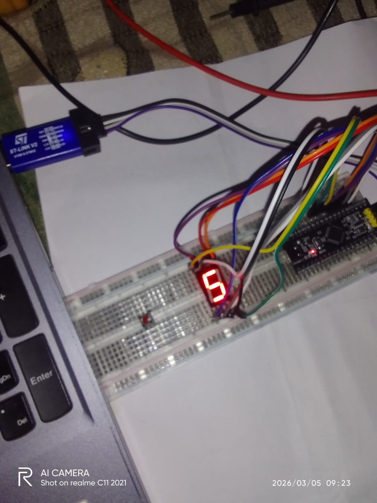
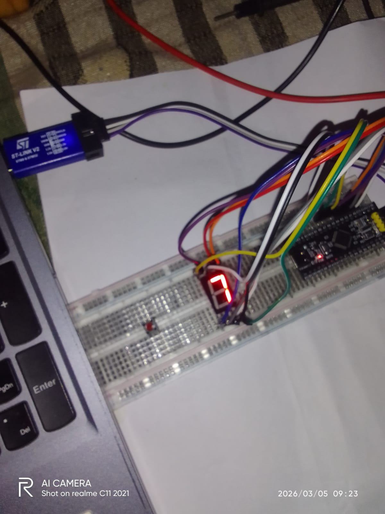
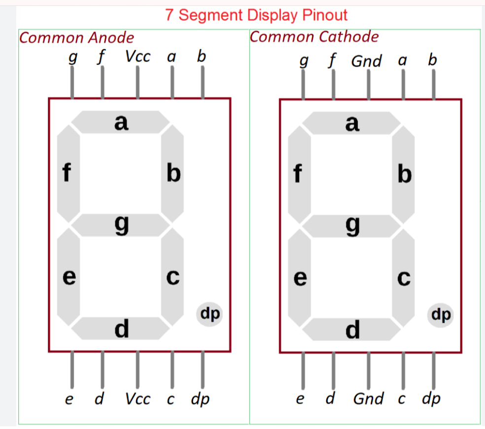

# 🔢 STM32F103 Bare Metal — Seven Segment Display Counter
### GPIO Output | Common Cathode | 0-9 Counter | Direct Register Access | Real World Applications

<div align="center">


</div>

---

## 📌 Project Overview

This project demonstrates **Seven Segment Display control** using **Bare Metal C** on STM32F103.
Auto counter 0-9 displayed on Common Cathode Seven Segment Display.
No HAL, No Library — Pure direct register manipulation.

### ✅ Key Features:
- Pure Bare Metal C — No HAL, No Library
- Direct Register Access
- Common Cathode Seven Segment
- Auto counter 0 to 9
- PA0-PA7 → Segments a-g + DP
- Software delay ~1 second per digit
- Compatible with STM32F103C6 and C8

---

## 🛠️ Hardware Used

| Component | Specification |
|-----------|-------------|
| MCU | STM32F103C6/C8T6 (Blue Pill) |
| Display | Seven Segment — Common Cathode |
| IDE | Keil MDK uVision |
| Programmer | STM32CubeProgrammer (ST-Link V2) |
| Power | 3.3V / 5V USB |

---

## 🔌 Hardware Connection

```
STM32 Blue Pill    Seven Segment (Common Cathode)
──────────────────────────────────────────────────
PA0          →     segment a
PA1          →     segment b
PA2          →     segment c
PA3          →     segment d
PA4          →     segment e
PA5          →     segment f
PA6          →     segment g
PA7          →     segment DP (optional)
GND          →     COM (Common Cathode GND)
```

### Seven Segment Pinout:
```
     aaa
    f   b
    f   b
     ggg
    e   c
    e   c
     ddd  .dp

Segment    Bit    PA Pin
────────────────────────
a        → bit0 → PA0
b        → bit1 → PA1
c        → bit2 → PA2
d        → bit3 → PA3
e        → bit4 → PA4
f        → bit5 → PA5
g        → bit6 → PA6
DP       → bit7 → PA7
```

---

## 💻 Full Code

```c
int main(void)
{
    unsigned int *RCC_APB2ENR = (unsigned int *)(0x40021000 + 0x18);
    unsigned int *GPIOA_CRL   = (unsigned int *)(0x40010800 + 0x00);
    unsigned int *GPIOA_ODR   = (unsigned int *)(0x40010800 + 0x0C);

    /* Common Cathode segment codes 0-9 */
    unsigned char segment_codes[] = {
        0x3F, /* 0 — 0011 1111 */
        0x06, /* 1 — 0000 0110 */
        0x5B, /* 2 — 0101 1011 */
        0x4F, /* 3 — 0100 1111 */
        0x66, /* 4 — 0110 0110 */
        0x6D, /* 5 — 0110 1101 */
        0x7D, /* 6 — 0111 1101 */
        0x07, /* 7 — 0000 0111 */
        0x7F, /* 8 — 0111 1111 */
        0x6F  /* 9 — 0110 1111 */
    };

    /* GPIOA Clock Enable */
    *RCC_APB2ENR |= (1 << 2);

    /* PA0-PA7 → Output 2MHz Push-Pull */
    *GPIOA_CRL = 0x22222222;

    while(1)
    {
        for(int i = 0; i < 10; i++)
        {
            *GPIOA_ODR = segment_codes[i];
            for(volatile int d = 0; d < 5000000; d++);
        }
    }
}
```

---

## 🧠 Code Explanation

### Segment Codes:
```
Common Cathode = HIGH pe segment ON

0x3F = 0011 1111
       bit: 76543210
            0gfedcba

Digit 0:
a=1, b=1, c=1, d=1, e=1, f=1, g=0
= 0x3F ✅

Digit 8:
a=1, b=1, c=1, d=1, e=1, f=1, g=1
= 0x7F ✅
```

### GPIO Config:
```c
*GPIOA_CRL = 0x22222222;
/* PA0-PA7 sab Output 2MHz
   Push-Pull mode mein set! */
```

### Display Logic:
```c
*GPIOA_ODR = segment_codes[i];
/* ODR mein code likhne se
   sahi segments ON ho jaate hain! */
```

---

## 📸 Hardware Demo

### Circuit Setup:






---

## 🎥 Video Demo

> ▶️ **[Click here to watch Seven Segment Counter working video](media/seven_seg.mp4)**

---

## 🌍 Real World Applications

---

### 🏭 1. Industrial
```
Seven Segment ki jagah:          Use Case:
─────────────────────────────────────────
Production counter display   →   Items count
Temperature display          →   Oven temp
Pressure display             →   PSI meter
Speed display                →   RPM meter
Timer display                →   Process timer

Real Examples:
→ Factory production line counter
→ Digital weighing machine display
→ Industrial timer/stopwatch
→ Machine cycle counter
→ Error code display
```

---

### 🚗 2. Automotive
```
Real Examples:
→ Odometer digit display
→ Gear position indicator (1-6)
→ Parking sensor distance display
→ Fuel level numeric display
→ Speed numeric display
→ Engine temperature display
→ Lap counter in racing
```

---

### 🏥 3. Medical
```
Real Examples:
→ Patient room number display
→ Queue number display
→ Medicine dose counter
→ Blood pressure reading display
→ Heart rate BPM display
→ Temperature reading display
→ IV drip counter
```

---

### 🏠 4. Home Appliances
```
Real Examples:
→ Microwave oven timer
→ Washing machine cycle display
→ AC temperature display
→ Water heater temperature
→ Digital clock display
→ Alarm clock digits
→ Oven temperature display
```

---

### 🎮 5. Gaming / Entertainment
```
Real Examples:
→ Score display in arcade games
→ Lives counter display
→ Timer countdown display
→ Coin counter display
→ Level number display
→ High score display
```

---

### 🔒 6. Security
```
Real Examples:
→ PIN entry display (****)
→ Attempt counter display
→ Zone number display
→ Access code display
→ Floor number in elevator
→ Wrong attempt counter
```

---

### 🌾 7. Agriculture
```
Real Examples:
→ Soil moisture % display
→ Temperature display (greenhouse)
→ Humidity % display
→ Irrigation timer display
→ Harvest counter
→ Water level display
```

---

## 📊 Seven Segment Codes Table

| Digit | Hex Code | Binary | Segments ON |
|-------|----------|--------|------------|
| 0 | 0x3F | 0011 1111 | a,b,c,d,e,f |
| 1 | 0x06 | 0000 0110 | b,c |
| 2 | 0x5B | 0101 1011 | a,b,d,e,g |
| 3 | 0x4F | 0100 1111 | a,b,c,d,g |
| 4 | 0x66 | 0110 0110 | b,c,f,g |
| 5 | 0x6D | 0110 1101 | a,c,d,f,g |
| 6 | 0x7D | 0111 1101 | a,c,d,e,f,g |
| 7 | 0x07 | 0000 0111 | a,b,c |
| 8 | 0x7F | 0111 1111 | a,b,c,d,e,f,g |
| 9 | 0x6F | 0110 1111 | a,b,c,d,f,g |

---

## ⚠️ Common Anode vs Common Cathode

| | Common Cathode | Common Anode |
|--|---------------|-------------|
| COM pin | GND | VCC |
| Segment ON | HIGH (1) | LOW (0) |
| Code | 0x3F for 0 | ~0x3F = 0xC0 for 0 |

---

## 📋 Register Reference

| Register | Address | Purpose |
|----------|---------|---------|
| RCC_APB2ENR | 0x40021018 | GPIOA Clock Enable |
| GPIOA_CRL | 0x40010800 | PA0-PA7 Configure |
| GPIOA_ODR | 0x4001080C | PA Output Write |

---

## 🎯 Key Learnings

```
✅ Array use — segment codes store
✅ For loop — 0-9 auto count
✅ ODR direct write — 8 pins ek saath
✅ Hex codes — segment pattern
✅ Common Cathode logic — HIGH = ON
✅ GPIO bulk config — 0x22222222
```

---

## 🚀 How to Flash

```
1. Keil MDK mein code paste karo
2. Device: STM32F103C8
3. Build karo (F7)
4. STM32CubeProgrammer se flash karo ✅
5. 0→9 counter dekho! 🎉
```

---

## 👨‍💻 Developer

**Ramsudarshan Maurya**
🎓 B.Tech ECE — AKTU Lucknow (2025)
🏢 Embedded Systems Intern — UniConverge Technologies, Noida
📚 IoT Trainee — IoT Academy, Noida
🏆 RoboRace 1st Prize | Published Researcher IJRPR

[](https://linkedin.com/in/ramsudarshanmaurya)
[](https://github.com/Ramsudarshanmaurya)

---

## 📄 License

MIT License — Free to use, modify and distribute.

---

<div align="center">

**⭐ Agar helpful laga toh Star zaroor do! ⭐**

*"Seven Segment = Display World ka Foundation!*
*Har digital display isi concept pe bana hai!"* 🔢🔧

</div>
